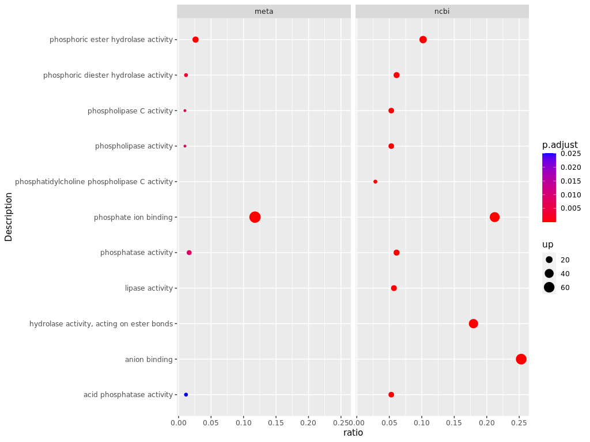
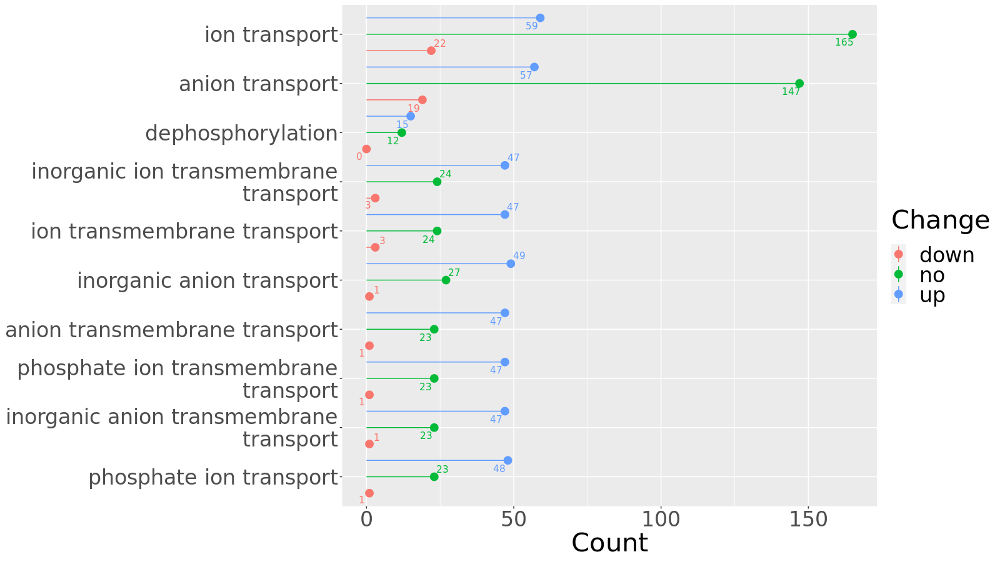

A Tale of Two Databases 📚
================
xyz
2020/5/25

  - The Meta DB and the Public DB can both perform well in soil
    proteomics 😊

  - Meta proteomics analysis pipeline based on Proteome Discovery output
    💡

  - Impacts of protein database on soil metaproteomics. XIONG Y, ZHENG
    L, MENG XX, SHEN RF, LAN P. (in review) 🕐
    
      - Reproduce this study

<!-- end list -->

``` bash
mkdir Proteomics
cd Proteomics
git clone https://github.com/xyz1396/Meta-proteomics-analysis-pipeline-based-on-Proteome-Discovery-output
# Run the rmd files in Rstudio
```

1)  [Download mass spectral data and build
    databases](Download%20mass%20spectral%20data%20and%20build%20databases.Rmd)

2)  [Calculate the protein sequence length of the two databases in
    detail For Table.
    1](Calculate%20the%20protein%20sequence%20length%20of%20the%20two%20databases%20in%20detail%20For%20Table.%201.Rmd)

3)  [Get Identified proteins, Coverage, Length, UpsetR, Venn For Fig. 2,
    Fig. S4, Fig. S1, Fig.
    3](Get%20Identified%20proteins,%20Coverage,%20Length,%20UpsetR,%20Venn%20For%20Fig.%202,%20Fig.%20S4,%20Fig.%20S1,%20Fig.%203.Rmd)


``` 
 compare length of identified proteins  
```

4)  [Volcano Plot For Fig. 4](Volcano%20Plot%20For%20Fig.%204.Rmd)


``` 
Meta DB VolcanoPlot  
```

5)  [Statistical comparison of microbial species identified by the two
    databases For Fig. 5, 6, Table.
    S4](Statistical%20comparison%20of%20microbial%20species%20identified%20by%20the%20two%20databases%20For%20Fig.%205,%206,%20Table.%20S4.rmd)


    Correlation of abundance identified by the two databases in LP with histogram 

6)  [Summary statistics of annotations For Fig.
    7](Summary%20statistics%20of%20annotations%20For%20Fig.%207.Rmd)


    Summary statistics of protein annotations 

7)  [Enrichment analysis For Fig. 8, Table
    S7](Enrichment%20analysis%20For%20Fig.%208,%20Table%20S7.Rmd)



    Enrichment analysis results 

8)  [Draw phosphatase and phosphatase evolutionary tree and add species
    annotation for Fig. 9,
    S3](Draw%20phosphatase%20and%20phosphatase%20evolutionary%20tree%20and%20add%20species%20annotation%20for%20Fig.%209,%20S3.rmd)

9)  [All identified proteins’s heatmap For Fig.
    S2](All%20identified%20proteins's%20heatmap%20For%20Fig.%20S2.Rmd)


    The heatmap of abundance of protein identified by the Meta DB 

10) [Blast the protein sequences identified by the 2 databases to each
    other For Fig.
    S5](Blast%20the%20protein%20sequences%20identified%20by%20the%202%20databases%20to%20each%20other%20For%20Fig.%20S5.rmd)


    Percentage of identical matches 

11) [Statistical comparison of PSMs of microbial species identified by
    the two databases For Fig.
    S6](Statistical%20comparison%20of%20PSMs%20of%20microbial%20species%20identified%20by%20the%20two%20databases%20For%20Fig.%20S6.rmd)


    PSMs of genera identified only by Meta DB and both DB 

12) [GO annotations of proteins with significantly differential
    abundance identified by the 2 DBs For Fig.
    S7](GO%20annotations%20of%20proteins%20with%20significantly%20differential%20abundance%20identified%20by%20the%202%20DBs%20For%20Fig.%20S7.rmd)



    The amount of proteins with significantly differential abundance identified by the Public DB
