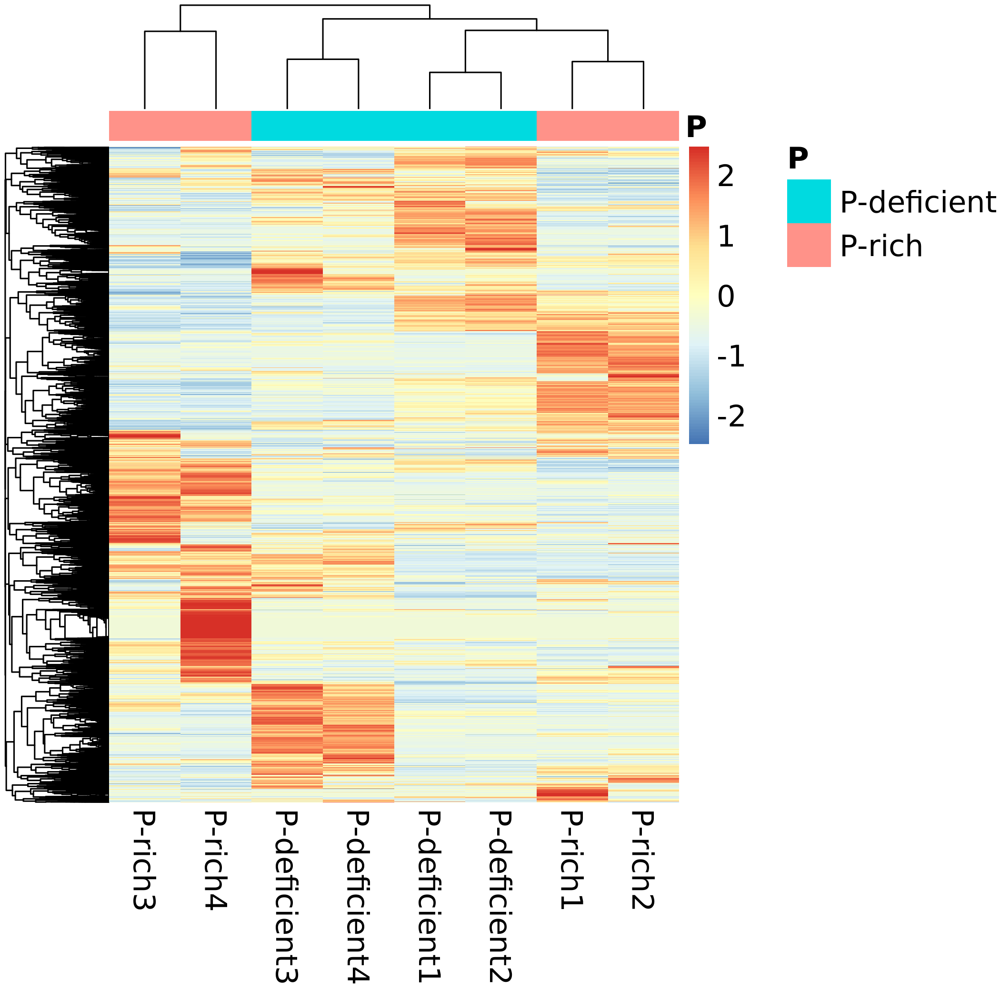

```{r setup, include=FALSE}
knitr::opts_chunk$set(echo = TRUE)
```

* The Meta DB and the Public DB can both perform well in soil proteomics 😊

* Meta proteomics analysis pipeline based on Proteome Discovery output 💡

* Impacts of protein database on soil metaproteomics. XIONG Y, ZHENG L, MENG XX, SHEN RF, LAN P. (in review) 🕐

    - Reproduce this study
    
```{bash,eval=F}
mkdir Proteomics
cd Proteomics
git clone https://github.com/xyz1396/Meta-proteomics-analysis-pipeline-based-on-Proteome-Discovery-output
# Run the rmd files in Rstudio
```

(@) [Download mass spectral data and build databases](Download mass spectral data and build databases.Rmd)

(@) [Calculate the protein sequence length of the two databases in detail For Table. 1](Calculate the protein sequence length of the two databases in detail For Table. 1.Rmd)

(@) [Get Identified proteins, Coverage, Length, UpsetR, Venn For Fig. 2, Fig. S4, Fig. S1, Fig. 3](Get Identified proteins, Coverage, Length, UpsetR, Venn For Fig. 2, Fig. S4, Fig. S1, Fig. 3.Rmd)

  
     
     compare length of identified proteins  
  
(@) [Volcano Plot For Fig. 4](Volcano Plot For Fig. 4.Rmd)

  
    
    Meta DB VolcanoPlot  
  
(@) [Statistical comparison of microbial species identified by the two databases For Fig. 5, 6, Table. S4](Statistical comparison of microbial species identified by the two databases For Fig. 5, 6, Table. S4.rmd)


    
    Correlation of abundance identified by the two databases in LP with histogram 
  
(@) [Summary statistics of annotations For Fig. 7](Summary statistics of annotations For Fig. 7.Rmd)


    
    Summary statistics of protein annotations 
    
(@) [Enrichment analysis For Fig. 8, Table S7](Enrichment analysis For Fig. 8, Table S7.Rmd)
  

    
    Enrichment analysis results 

(@) [Draw phosphatase and phosphatase evolutionary tree and add species annotation for Fig. 9, S3](Draw phosphatase and phosphatase evolutionary tree and add species annotation for Fig. 9, S3.rmd)


(@) [All identified proteins's heatmap For Fig. S2](All identified proteins's heatmap For Fig. S2.Rmd)

 
    
    The heatmap of abundance of protein identified by the Meta DB 

(@) [Blast the protein sequences identified by the 2 databases to each other For Fig. S5](Blast the protein sequences identified by the 2 databases to each other For Fig. S5.rmd)


    
    Percentage of identical matches 

(@) [Statistical comparison of PSMs of microbial species identified by the two databases For Fig. S6](Statistical comparison of PSMs of microbial species identified by the two databases For Fig. S6.rmd)


    
    PSMs of genera identified only by Meta DB and both DB 

(@) [GO annotations of proteins with significantly differential abundance identified by the 2 DBs For Fig. S7](GO annotations of proteins with significantly differential abundance identified by the 2 DBs For Fig. S7.rmd)


    
    The amount of proteins with significantly differential abundance identified by the Public DB


